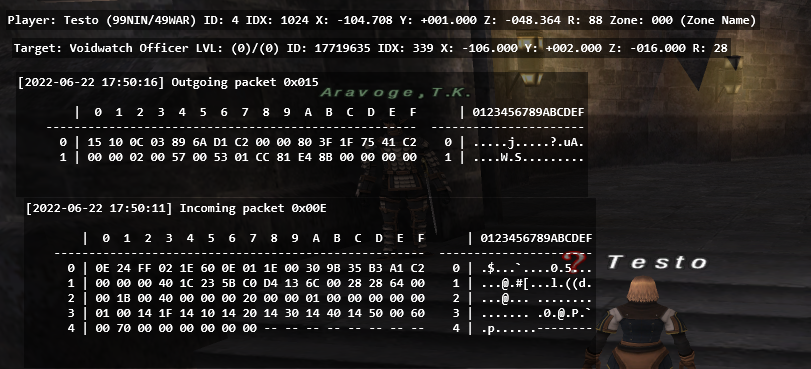
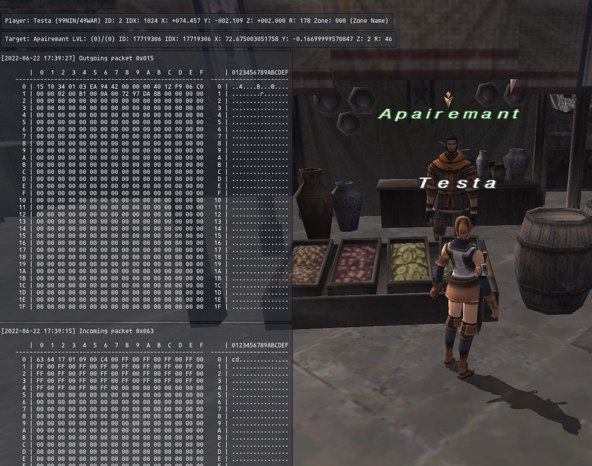
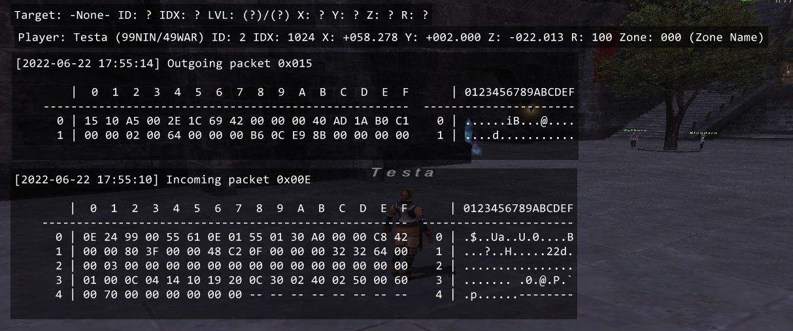

# 👨‍✈️ captain

A suite of packet capture and analysis tools for FFXI targeting Windower v4, Ashita v3, and Ashita v4.

## Goal

Windower and Ashita are both great, but they offer different APIs for inspecting and interacting with FFXI.

- `captain` - The logic for capturing and analyzing packets.
- `backend` - A "cross-platform" set of functions that can be used in both Windower and Ashita.

### Ashita v3



### Ashita v4



### Windower v4



## Instructions

### Windower

- Download and place in `<Windower folder>/addons`
- Either:
  - Add to `scripts/init.txt` to auto-load when you log in
  - Load on demand with `//lua load captain`
- Unload with `//lua unload captain`

### Ashita

- Download and place in `<Ashita folder>/addons`
- Either:
  - Add to `scripts/Default.txt` to auto-load when you log in
  - Load on demand with `/addon load captain`
- Unload with `/addon unload captain`

### General

- `/captain hide` to stop showing the GUI elements
- `/captain show` to show the GUI elements
- `SHIFT + DRAG` to drag text boxes around
- (TODO) To start a capture press: `CTRL + ALT + C`
- (TODO) To end a capture press: `CTRL + ALT + V`

### Development

- TODO

```bat
C:\ffxi>mklink /D C:\ffxi\Ashita\addons\captain C:\ffxi\captain
symbolic link created for C:\ffxi\Ashita\addons\captain <<===>> C:\ffxi\captain

C:\ffxi>mklink /D C:\ffxi\Windower\addons\captain C:\ffxi\captain
symbolic link created for C:\ffxi\Windower\addons\captain <<===>> C:\ffxi\captain
```

## Based on & made possible by

- [Windower](https://www.windower.net/)
- [Ashita](https://ashitaxi.com/)
- `Packeteer` by atom0s
- `capture` by ibm2431
- `PacketViewer` by Arcon
